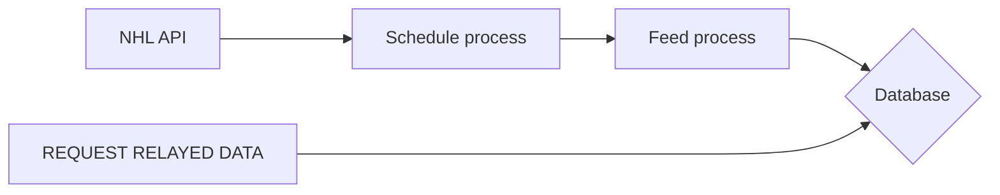

## Sportradar advanced challenge Solution

### Application Workflow
- When the application starts up, it fetches the game schedules from NHL web API.
- The application then iterates through the list of games and sets up a cron job for each game based on its start time. The cron job is set up to run a specific command at the scheduled time.
- At the scheduled time, the cron job triggers a process that checks the status of the game. If the game is live, the process triggers another action to watch for the game feed and store the game data.

Prerequisites:
  - Install Docker and have it running.

**RUNNING**
`docker compose up -d --build`

**FETCH GAMES**
- For fetching all games
`docker exec -it pipeline rake games`

- For fetching a particular game by game ID
`docker exec -it pipeline rake games game_id=GAMEID`

- For fetching games by season
`docker exec -it pipeline rake games season=SEASON`

**TESTING**
`docker exec -it pipeline rake test`

**STOPPING**
`docker compose down && docker rmi nhl_pipeline --force && docker volume rm nhl-data-pipeline_db-volume`